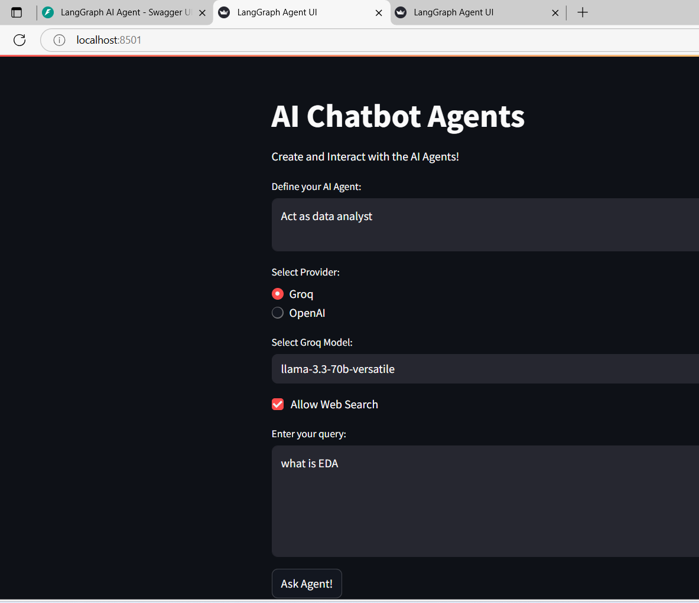
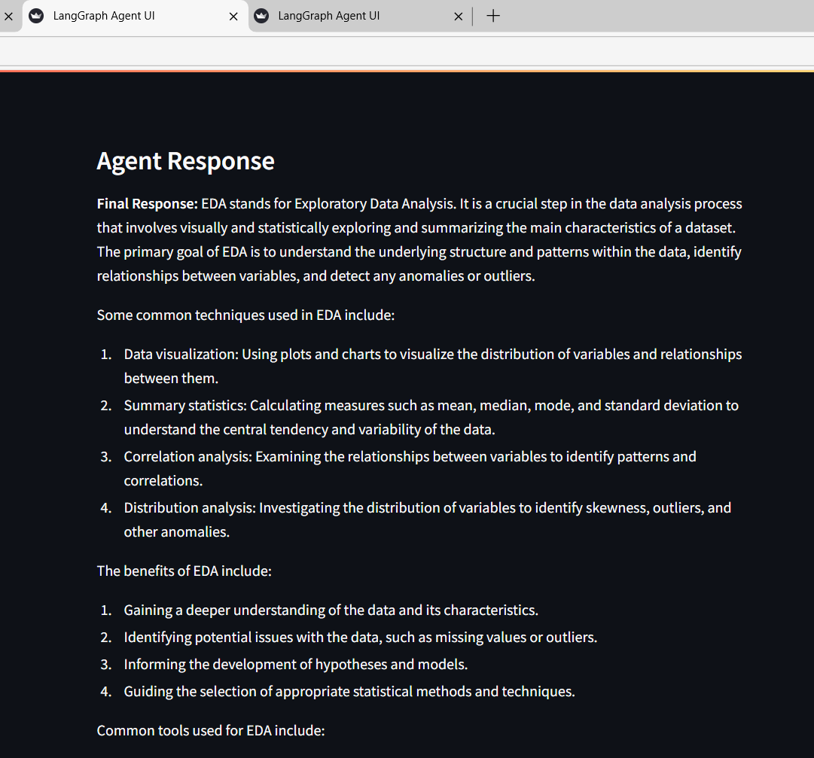
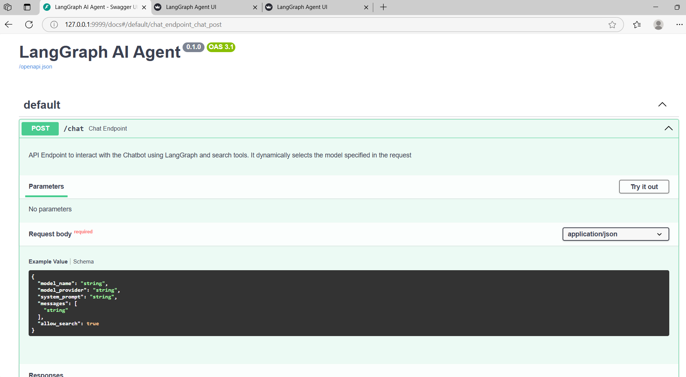

# AI_agent_chatbot

# 🤖 AI Agent Chatbot with FastAPI and Streamlit

A multi-phase Python project that builds an intelligent chatbot agent using OpenAI, served through a FastAPI backend and a Streamlit frontend.

---

## 📁 Project Structure

- `ai_agent.py` — Core AI agent logic
- `backend.py` — FastAPI backend server
- `frontend.py` — Streamlit-based user interface
- `.env` — Store API keys (Do **not** push this to GitHub)
- `requirements.txt` — Python dependencies
- `venv/` — Virtual environment (excluded from version control)

---

## 🛠️ Getting Started

### 1. Clone the Repository

```bash
git clone https://github.com/your-username/your-repo-name.git
cd your-repo-name
```

### 2. Create and Activate a Virtual Environment

#### macOS/Linux:

```bash
python -m venv venv
source venv/bin/activate
```

### 3. Install Dependencies

```bash
pip install -r requirements.txt
```

---

## 🚀 Running the Project

### 🔹 Phase 1: Create AI Agent

This initializes and tests the core chatbot logic using the OpenAI API.

```bash
python ai_agent.py
```

### 🔹 Phase 2: Start Backend with FastAPI

Run the backend server.

```bash
python backend.py
```

FastAPI will be available at:  
[http://127.0.0.1:8000/docs](http://127.0.0.1:8000/docs)

### 🔹 Phase 3: Launch Frontend with Streamlit

This serves the user interface to chat with the AI agent.

```bash
python frontend.py
```

The Streamlit app will be available at:  
[http://localhost:8501](http://localhost:8501)

---

## 🔐 Environment Variables

Create a `.env` file in your project root with your OpenAI API key:

```
OPENAI_API_KEY="your_openai_key_here"
GROQ_API_KEY =""
TAVILY_API_KEY=""
```
### UI Snapshots



### Swagger Docs (/chat endpoint)



---
